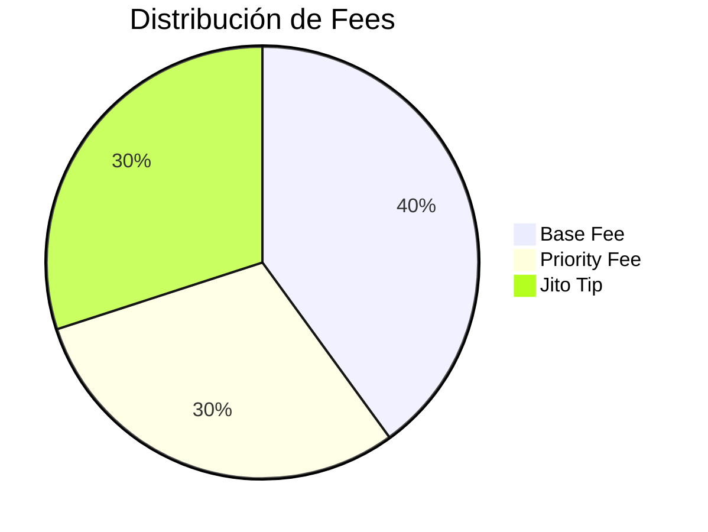

# 🚀 Trading Bot en Solana

## 📌 Descripción General
Este bot está diseñado para operar en **Solana**, automatizando la detección, compra y venta de tokens en DEXs como **Jupiter**, **Raydium**, **Pump**, **Meteora** y otros.  
Incluye integración con **Telegram** para enviar alertas y logs de operaciones, y maneja de forma segura claves privadas y conexiones RPC.

---

## ⚠️ Jito: lo Abusivo
[Jito](https://jito.network/) es un servicio que permite pagar propinas adicionales (`TIP_SOL`) a validadores para priorizar transacciones.  
- ✅ Ventaja: más rapidez en la inclusión de la transacción.  
- ❌ Desventajas / abusos:
  - Mercado de **MEV (Maximum Extractable Value)**.  
  - Se incentiva el **front-running** y ataques sandwich.  
  - Aumenta los costos al usuario promedio.  

En el código (`saldo.py`) se ve cómo se calculan los **fees totales**:  
- `base_fee`  
- `priority_fee` (`UNIT_PRICE` × `UNIT_BUDGET`)  
- `jito_tip` (`TIP_SOL`)  

👉 Resultado: los usuarios normales terminan subsidiando a los bots con más recursos.

---

## 🥪 Sandwich en Solana
Un ataque *sandwich* consiste en:  
1. Bot **compra antes** que tú → sube el precio.  
2. **Tu transacción ejecuta** pagando más caro.  
3. Bot **vende después** → se queda con la ganancia.  

En Solana esto es posible gracias a **Jito Bundles** y al control del orden en los bloques.

---

## ⚙️ Componentes del Bot

### Archivos principales
- **`main.py`** → detección de tokens (Dexscreener API, Rugcheck), gestión de alertas Telegram.  
- **`buy.py` / `swaps.py`** → ejecución de compras y ventas automáticas.  
- **`saldo.py`** → cálculo de saldo real disponible, fees y tips.  
- **`jupiter.py`** → integración con Jupiter v6 (swaps, quotes, confirmaciones).  

### Variables de entorno (.env)
- `RPC` → endpoint de Solana.  
- `PRIVATE_KEY` → clave de la wallet (base58 o JSON).  
- `BOT_TOKEN`, `CHAT_ID` → credenciales de Telegram.  
- `USE_JITO`, `TIP_SOL` → control de propinas Jito.  
- `UNIT_PRICE`, `UNIT_BUDGET` → configuración de priority fees.  
- `MAX_FRACTION_OF_BALANCE`, `FEE_CUSHION_SOL` → control de riesgo de balance.  

### Estrategia
- Detección de tokens con eventos (pump, rugged, tier-1, listed_on_cex).  
- Validación con **Rugcheck** + blacklists.  
- Auto-compra si pasa filtros.  
- Ejecución de ventas parciales (`SELL_PLAN`) cuando sube el precio.  
- Control estricto de saldo utilizable.  

---

## 📊 Gráficos Teóricos

### Distribución de Fees


### Ejemplo de Ondas (Sandwich)
- Ola 1: Bot compra (precio sube).  
- Ola 2: Usuario compra (precio aún más alto).  
- Ola 3: Bot vende (precio vuelve a bajar).  

---

## 🔗 Flujo del Bot
1. Detección de token 📡.  
2. Validación de riesgos 🚦.  
3. Compra en Jupiter / DEX seleccionado 💸.  
4. Registro y alerta en Telegram 📲.  
5. Ventas parciales automáticas 📉.  

---

## 📬 Telegram
El bot utiliza la API de Telegram:  
```
https://api.telegram.org/bot{BOT_TOKEN}/sendMessage?chat_id={CHAT_ID}&text=...
```

De esta forma, todas las operaciones quedan registradas directamente en tu canal o grupo.  

---

## ✅ Conclusiones
Este bot automatiza el trading en Solana pero **expone los riesgos del MEV y Jito**, que pueden ser abusivos.  
Se recomienda siempre:  
- Ajustar bien los parámetros de fees.  
- Usar límites de balance (`MAX_FRACTION_OF_BALANCE`).  
- Monitorear Telegram para validar operaciones en tiempo real.  
